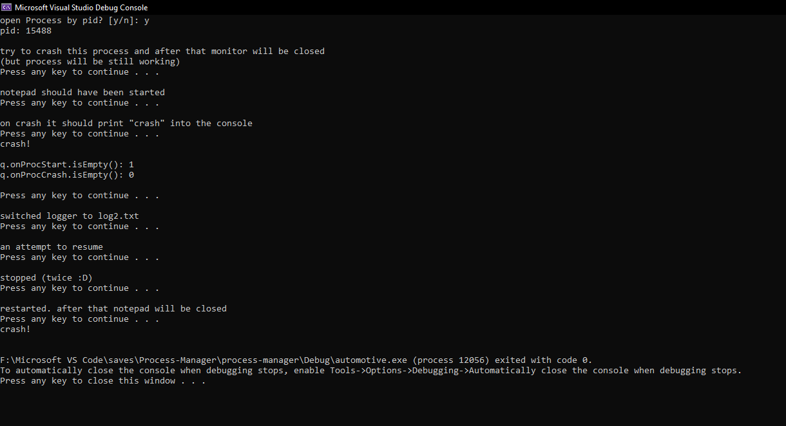
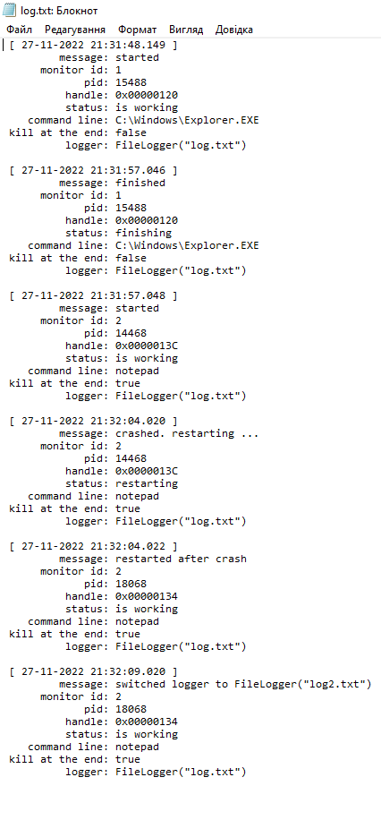
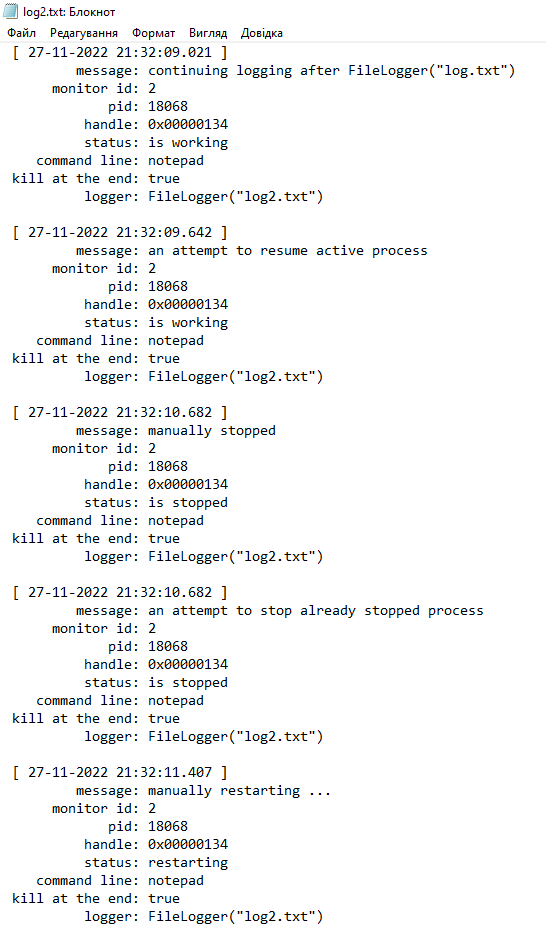
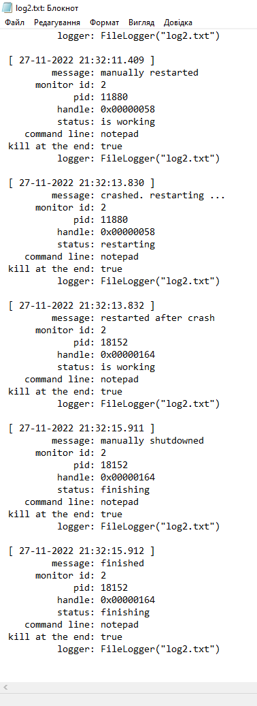

# Проєкт "Менеджер процесів"
## Зміст
1. [Опис](#Опис)
2. [Вимоги](#Вимоги)
3. [Результат](#Результат)
____
## Опис
Менеджер процесів дозволяє запуск усіх додатків з необхідними параметрами і перезапуск при передчасному завершенні додатку.
____
## Вимоги
- Менеджер процесів повинен відстежувати чи всі додатки запущені з необхідними параметрами
- Перезапускати додаток при передчасному завершені
- Якщо виникає помилка, то виводити її користувачу
____
## Результат
Запуск програми
</img>

</img>
____
Результат
</img>

</img>

</img>
____